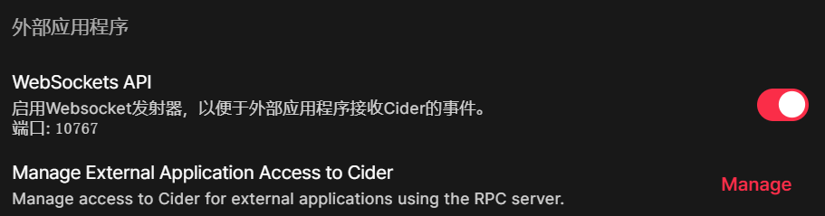
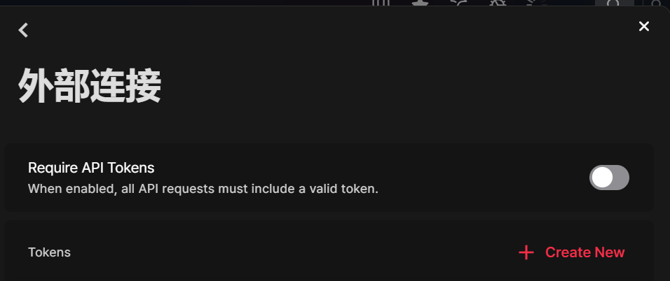

# Flow.Launcher.Plugin.Cider2

Control [Cider2](https://cider.sh/) inside [Flow Launcher](https://flowlauncher.com/), default keyword is `cd`

## Requirements

- [Flow Launcher](https://flowlauncher.com/)
- [Cider2](https://cider.sh/) version 2.5.0 or later

## Usage

This plugin requires Cider's WebSocket API, should be enabled in Cider's settings.(Setting > Connectivity), default port is `10676`

By default, the plugin won't use a token, the setting `Require API Tokens` should be disabled.

